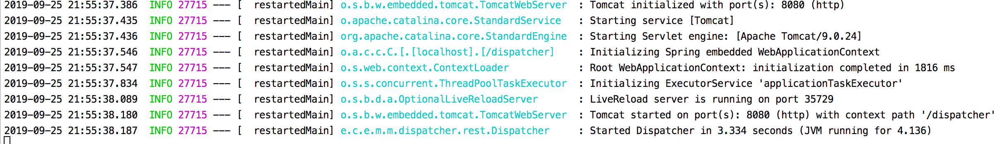

Dispatcher Microservice
----
A microservice project based on Spring Boot.

## Configuration
### For the embedded Tomcat server
The configuration is available in  _application.yml_ inside the app distribution:
```yaml
server:
    port: 8080
    servlet:
        context-path: /topics
```
### For the Kafka broker
```yaml
kafka:
  bootstrap-servers: localhost:9092
  consumer:
    auto-offset-reset: earliest
    group-id: kafka-dispatcher
    topics: oncorseq_sequencing_pipeline_initialized,oncorseq_sequencing_in_progress,oncorseq_sequencing_analysis_started
```
Where:
* _bootstrap-servers_ is the list of kafka brokers to connect to (see [Apache Kafka instructions](APACHE_KAFKA.md))
* _group_id_ is the ID of the consumer group
* _topics_ is the comma-separated list of topics of interest (see next section)

### For the application logic:
For each message under the topic of interest, the Dispatcher launches the associated trigger(s). The following sample instance shows the expected format for this part of the configuration:

```yaml
topics:
  - topic: oncorseq.sequencing.in_progress
    actions:
      - trigger: nextflow main.nf --sampleID=${payload}
        reply:
          topic: oncorseq.sequencing.pipeline_initialized
          payload: ${payload}
      - trigger: https://mymicroservice/name/api?param=value&sampleID=${payload}
        reply:
            topic: oncorseq.sequencing.antoher1
            payload: ${payload}
      - trigger: whatever you want with ${payload}
        reply:
            topic: oncorseq.sequencing.another2
            payload: ${payload}

  - topic: seq_failed
    actions:
      - trigger: command/URL for seq_failed
        reply:
          topic: annotation_started
          payload: ${payload}
      - trigger: another command/URL for seq_failed
        reply:
          topic: annotation_started
          payload: ${payload}

  - topic: analysis_started
    actions:
      - trigger: command/URL for analysis_started
        reply:
          topic: analysis_in_progress
          payload: ${payload}


kafka:
  broker: kafka.med.cornell.edu:9092
  groupId: consumerGroup1

```
The above YAML must be passed as property with

    -Ddispatcher.config=path/topics-config.yml

to the server application. 
### Custom configuration

#### Configuration File
Boot applies its typical convention over configuration approach to property files. This means that we can simply put an “application.yml” file in our “src/main/resources” directory, and it will be auto-detected. We can then inject any loaded properties from it as normal.

So, by using this default file, we don’t have to explicitly register a PropertySource, or even provide a path to a property file.

We can also configure a different file at runtime if we need to, using an environment property:
	
    java -jar app.jar --spring.config.location=classpath:/another-location/application.yml

#### Properties from Command Line Arguments

As opposed to using files, properties can be passed directly on the command line:
	
    java -jar app.jar --property="value"

You can also do this via system properties, which are provided before the -jar command rather than after it:
	
    java -Dproperty.name="value" -jar app.jar
    
## Building and Packaging
~~~
./mvnw clean package
~~~

## Execution
### Activation with the embedded Tomcat server
~~~
./startDispatcher.sh
~~~



### Or run spring boot directly
    mvn spring-boot:run

## Or package and run it 
     mvn package
     java -jar target/dispatcher-1.0-SNAPSHOT.jar

### Interface

Sample invocations:
~~~
http://localhost:8080/topics/ (welcome message)
http://localhost:8080/topics/configuration (shows the entire configuration)
http://localhost:8080/topics/configuration/topics (shows all topics of interest)
http://localhost:8080/topics/configuration/actions?topic=topicA (shows all actions of interest for the topic)
http://localhost:8080/topics/dispatch?topic=seq_complete&payload=sample123 (simulate a message, shows the trigger(s) with payload)
http://localhost:8080/topics/publish?topic=annotation_done&payload=sample123 (simulate a message, shows the message to send with payload)

~~~
The (optional) value of _payload_ replaces the _${payload}_ placeholder in the trigger, if used.
## Built With
* [Spring Boot](https://spring.io/projects/spring-boot) - A framework that makes it easy to create stand-alone, production-grade Spring-based Applications
* [Spring Kafka](https://spring.io/projects/spring-kafka) - Spring concepts for the development of Kafka-based messaging solutions
* [OpenJDK](https://openjdk.java.net/) - A free and open-source implementation of the Java Platform, Standard Edition
* [Maven](https://maven.apache.org/) - For dependency management
